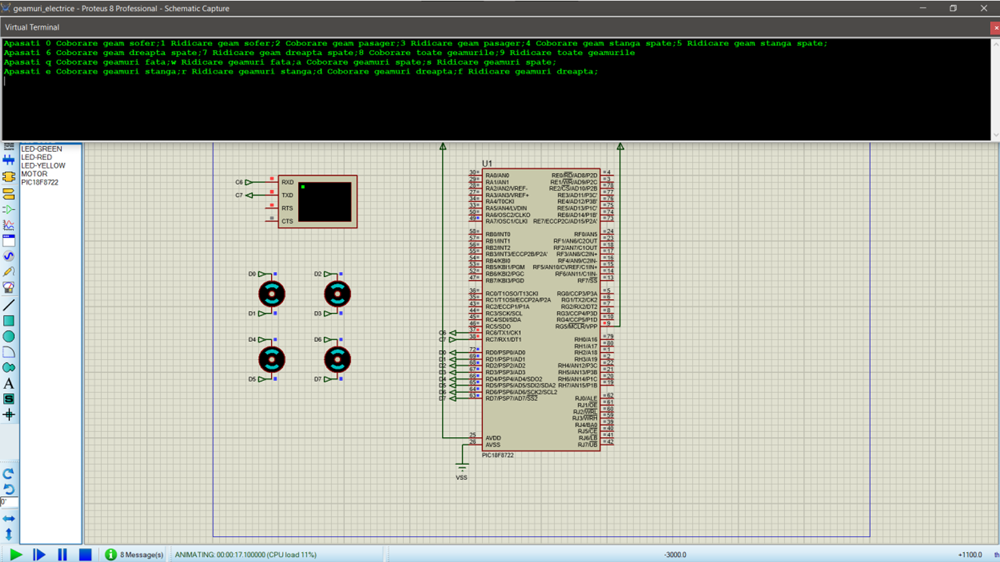

# Controlul geamurilor electrice auto cu PIC18F8722

## 🇷🇴 Română

### 1. Descriere

Acest proiect implementează o simulare a unui sistem de **control al geamurilor electrice auto**, utilizând microcontrolerul **PIC18F8722** și limbajul de programare C.

Sistemul permite controlul individual sau simultan al celor patru geamuri ale unui autoturism. Comenzile sunt transmise prin interfața serială UART, iar microcontrolerul interpretează caracterele primite și activează ieșirile corespunzătoare motoarelor.

Proiectul este realizat și testat în **Proteus** și are scop educațional, demonstrând principiile de control al unor actuatoare folosind un microcontroler.

---

### 2. Scopul proiectului

Scopul proiectului este simularea unui sistem de geamuri electrice pentru un autoturism.

Sunt disponibile comenzi pentru:

- coborârea geamului șoferului;
- ridicarea geamului șoferului;
- coborârea geamului pasagerului;
- ridicarea geamului pasagerului;
- coborârea și ridicarea geamurilor spate;
- controlul simultan al tuturor geamurilor;
- controlul geamurilor din față;
- controlul geamurilor din spate;
- controlul geamurilor din partea stângă;
- controlul geamurilor din partea dreaptă.

Prin combinația semnalelor digitale de pe PORTD sunt controlate cele patru motoare din sistemul simulat.

---

### 3. Hardware utilizat

Componenta principală este microcontrolerul **PIC18F8722**.

Componentele principale utilizate în simulare sunt:

- **Microcontroler:** PIC18F8722
- **Ieșiri pentru motoare:** PORTD
- **Comunicație:** UART1
- **TX:** RC6
- **RX:** RC7
- **Simulator:** Proteus
- **Actuatoare:** patru motoare reprezentând mecanismele geamurilor

Fiecare motor este controlat prin două semnale digitale, unul pentru fiecare sens de deplasare.

---

### 4. Comunicația UART

Interacțiunea cu sistemul se realizează prin UART.

Microcontrolerul este configurat pentru comunicație serială asincronă, cu o viteză de aproximativ **19200 bps**.

Comenzile sunt transmise sub forma unor caractere:

- cifrele `0`–`9`;
- caracterele `q`, `w`, `a`, `s`, `e`, `r`, `d`, `f`.

La primirea unei comenzi, este declanșată rutina de întrerupere, iar caracterul este analizat și asociat unei anumite acțiuni asupra geamurilor.

După executarea comenzii, sistemul transmite prin UART un mesaj care descrie acțiunea efectuată.

---

### 5. Comenzile sistemului

| Comandă | Acțiune |
|---|---|
| `0` | Coborâre geam șofer |
| `1` | Ridicare geam șofer |
| `2` | Coborâre geam pasager |
| `3` | Ridicare geam pasager |
| `4` | Coborâre geam stânga spate |
| `5` | Ridicare geam stânga spate |
| `6` | Coborâre geam dreapta spate |
| `7` | Ridicare geam dreapta spate |
| `8` | Coborâre toate geamurile |
| `9` | Ridicare toate geamurile |
| `q` | Coborâre geamuri față |
| `w` | Ridicare geamuri față |
| `a` | Coborâre geamuri spate |
| `s` | Ridicare geamuri spate |
| `e` | Coborâre geamuri stânga |
| `r` | Ridicare geamuri stânga |
| `d` | Coborâre geamuri dreapta |
| `f` | Ridicare geamuri dreapta |

Acest sistem de comenzi permite atât controlul individual al geamurilor, cât și controlul unor grupuri de geamuri.

---

### 6. Implementarea software

Programul este scris în limbajul C și utilizează biblioteca `xc.h` pentru accesul la registrele microcontrolerului.

Principalele funcții sunt:

- `init_USART()` – configurează interfața UART;
- `write_serial()` – transmite un caracter;
- `read_serial()` – citește caracterul primit;
- `write_ms()` – transmite mesaje text;
- `ISR()` – procesează întreruperile și comenzile;
- `main()` – configurează porturile și inițializează sistemul.

PORTD este utilizat pentru controlul celor patru motoare.

Fiecărei comenzi îi corespunde o combinație specifică de niveluri logice pe RD0–RD7.

---

### 7. Principiul de control al motoarelor

Fiecare geam este reprezentat de un motor controlat prin două ieșiri digitale.

În funcție de combinația celor două semnale, motorul poate fi comandat pentru:

- coborârea geamului;
- ridicarea geamului;
- oprirea motorului.

Prin utilizarea simultană a mai multor perechi de ieșiri, sistemul poate controla mai multe geamuri în același timp.

De exemplu, comenzile pentru toate geamurile generează simultan semnale pentru cele patru motoare.

---

### 8. Simularea în Proteus

Proiectul poate fi testat în Proteus fără utilizarea unui autoturism sau a unui sistem hardware real.

Simularea permite verificarea:

- comunicației UART;
- comenzilor individuale;
- comenzilor pentru grupuri de geamuri;
- schimbării direcției motoarelor;
- reacției microcontrolerului la comenzile primite.

Pentru testare:

1. se deschide schema Proteus;
2. se încarcă fișierul `.hex` în PIC18F8722;
3. se pornește simularea;
4. se utilizează terminalul UART;
5. se transmite una dintre comenzile implementate;
6. se observă motorul sau motoarele activate.

---

### 9. Structura proiectului

```text
Controlul-geamurilor-electrice-PIC18F8722/
│
├── README.md
│
├── src/
│   └── control_geamuri.c
│
├── proteus/
│   └── control_geamuri.pdsprj
│
├── Documentation/
│   ├── documentatie.docx
│   └── documentatie.pdf
│
└── Images/
    └── schema.png
```

### 10. Cum se testează

Pașii generali pentru testarea proiectului sunt:

1. compilarea codului C;
2. generarea fișierului `.hex`;
3. încărcarea fișierului în microcontrolerul din Proteus;
4. pornirea simulării;
5. deschiderea terminalului UART;
6. transmiterea comenzilor;
7. verificarea mesajului primit;
8. observarea acționării motoarelor.

Exemple:

```text
0 → Coborâre geam șofer
1 → Ridicare geam șofer
8 → Coborâre toate geamurile
9 → Ridicare toate geamurile
q → Coborâre geamuri față
w → Ridicare geamuri față
```

---

### 11. Concluzie

Proiectul demonstrează implementarea unui sistem simplificat de **control al geamurilor electrice auto** folosind microcontrolerul PIC18F8722.

Prin intermediul comunicației UART, utilizatorul poate transmite comenzi pentru controlul individual sau simultan al celor patru geamuri.

Proiectul evidențiază utilizarea:

- programării embedded în C;
- microcontrolerului PIC18F8722;
- comunicației UART;
- întreruperilor;
- GPIO;
- controlului motoarelor;
- simulării Proteus;
- procesării comenzilor într-un sistem embedded.

---

## 🖼️ Schema circuitului



---

# 🇬🇧 English

## 1. Description

This project implements a simulation of an **automotive power-window control system** using the **PIC18F8722** microcontroller and the C programming language.

The system allows individual or simultaneous control of the four vehicle windows. Commands are transmitted through the UART serial interface, and the microcontroller interprets the received characters and activates the appropriate motor outputs.

The project is developed and tested in **Proteus** and has an educational purpose, demonstrating the principles of actuator control using a microcontroller.

---

## 2. Project Purpose

The purpose of this project is to simulate a power-window system for a vehicle.

The implemented commands provide control for:

- driver's window down;
- driver's window up;
- passenger window down;
- passenger window up;
- rear window control;
- simultaneous control of all windows;
- front window control;
- rear window control;
- left-side window control;
- right-side window control.

The four motors in the simulated system are controlled through combinations of digital signals on PORTD.

---

## 3. Hardware Used

The main component is the **PIC18F8722** microcontroller.

Main components used in the simulation include:

- **Microcontroller:** PIC18F8722
- **Motor outputs:** PORTD
- **Communication:** UART1
- **TX:** RC6
- **RX:** RC7
- **Simulator:** Proteus
- **Actuators:** four motors representing the window mechanisms

Each motor is controlled using two digital signals, one for each direction of movement.

---

## 4. UART Communication

The system is controlled through the UART interface.

The microcontroller is configured for asynchronous serial communication at approximately **19200 bps**.

Commands are transmitted using the following characters:

- digits `0`–`9`;
- characters `q`, `w`, `a`, `s`, `e`, `r`, `d`, `f`.

When a command is received, the UART interrupt routine is triggered. The received character is then interpreted and associated with a specific window-control action.

After processing the command, the system sends a UART message describing the performed action.

---

## 5. System Commands

| Command | Action |
|---|---|
| `0` | Driver window down |
| `1` | Driver window up |
| `2` | Passenger window down |
| `3` | Passenger window up |
| `4` | Left rear window down |
| `5` | Left rear window up |
| `6` | Right rear window down |
| `7` | Right rear window up |
| `8` | All windows down |
| `9` | All windows up |
| `q` | Front windows down |
| `w` | Front windows up |
| `a` | Rear windows down |
| `s` | Rear windows up |
| `e` | Left windows down |
| `r` | Left windows up |
| `d` | Right windows down |
| `f` | Right windows up |

This command structure allows both individual window control and grouped window control.

---

## 6. Software Implementation

The software is written in C and uses the `xc.h` header to access the microcontroller registers.

The main functions are:

- `init_USART()` – configures the UART interface;
- `write_serial()` – transmits a character;
- `read_serial()` – reads the received character;
- `write_ms()` – transmits text messages;
- `ISR()` – processes interrupts and commands;
- `main()` – configures the ports and initializes the system.

PORTD is used to control the four motors.

Each command corresponds to a specific combination of logic levels on RD0–RD7.

---

## 7. Motor Control Principle

Each window is represented by a motor controlled through two digital outputs.

Depending on the combination of the two signals, the motor can be commanded to:

- lower the window;
- raise the window;
- stop.

By activating multiple output pairs simultaneously, the system can control several windows at the same time.

For example, commands for all windows generate control signals for all four motors simultaneously.

---

## 8. Proteus Simulation

The project can be tested in Proteus without requiring an actual vehicle or physical hardware.

The simulation allows verification of:

- UART communication;
- individual commands;
- grouped window commands;
- motor direction changes;
- microcontroller response to received commands.

Testing procedure:

1. open the Proteus schematic;
2. load the `.hex` file into the PIC18F8722;
3. start the simulation;
4. open the UART terminal;
5. send one of the implemented commands;
6. observe the activated motor or motors.

---

## 9. Project Structure

```text
Controlul-geamurilor-electrice-PIC18F8722/
│
├── README.md
│
├── src/
│   └── control_geamuri.c
│
├── proteus/
│   └── control_geamuri.pdsprj
│
├── Documentation/
│   ├── documentatie.docx
│   └── documentatie.pdf
│
└── Images/
    └── schema.png
```

---

## 10. How to Test

General testing steps:

1. compile the C source code;
2. generate the `.hex` file;
3. load the file into the microcontroller model in Proteus;
4. start the simulation;
5. open the UART terminal;
6. send commands;
7. verify the response message;
8. observe the motor operation.

Examples:

```text
0 → Driver window down
1 → Driver window up
8 → All windows down
9 → All windows up
q → Front windows down
w → Front windows up
```

---

## 11. Conclusion

This project demonstrates the implementation of a simplified **automotive power-window control system** using the PIC18F8722 microcontroller.

Through UART communication, the user can send commands for individual or simultaneous control of the four windows.

The project demonstrates the use of:

- embedded C programming;
- the PIC18F8722 microcontroller;
- UART communication;
- interrupts;
- GPIO;
- motor control;
- Proteus simulation;
- command processing in an embedded system.

---

## 🖼️ Schema circuitului


---

## 👤 Autor / Author

**IonutD**
